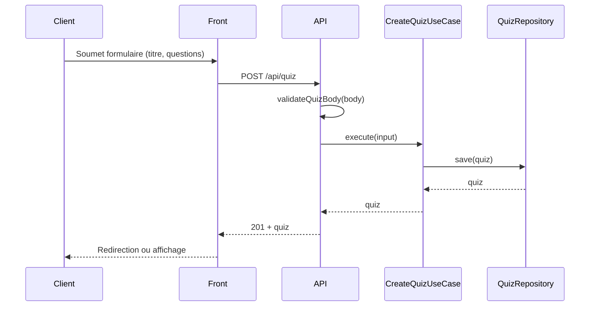
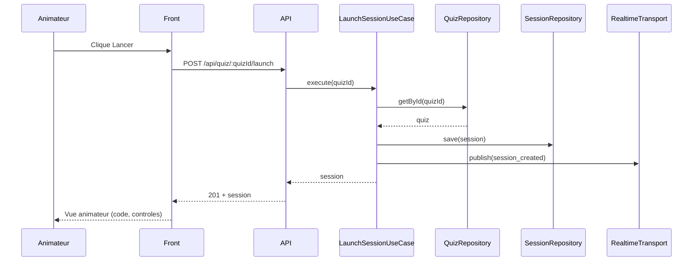
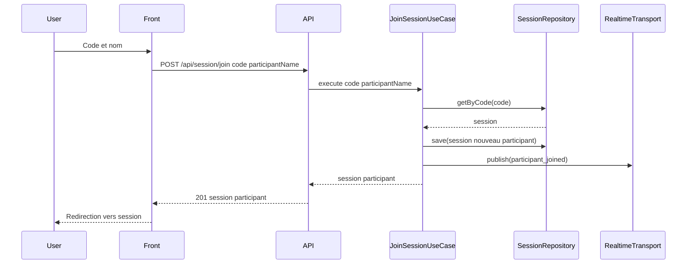
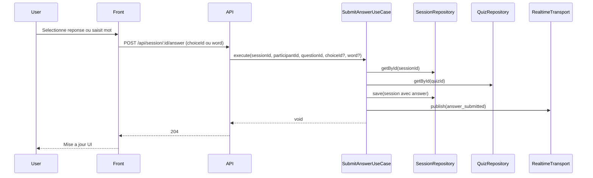
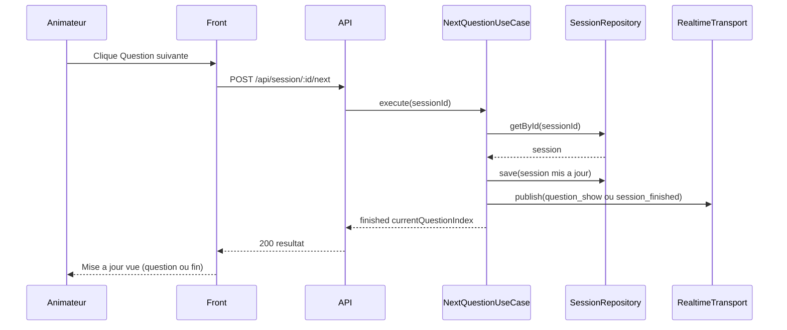
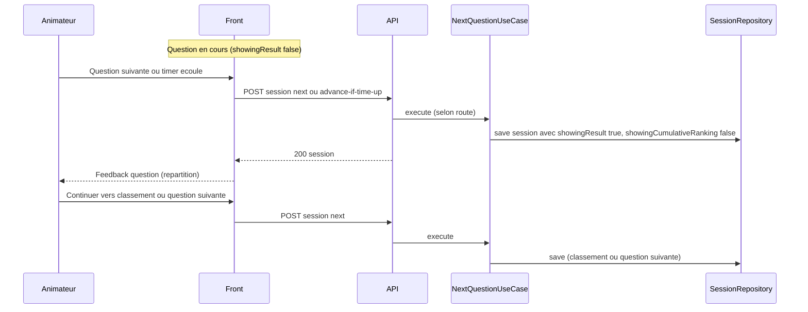

# Architecture et principes SOLID

## 1. Structure du monorepo (implémentée)

Le code est organisé en **monorepo** avec des packages partagés et deux applications déployables :

```
kahin/
├── apps/
│   ├── front/           # Next.js — accueil, créer QCM, lancer session, rejoindre, participer
│   └── api/             # Express — REST API (ex. Render) ; quiz prod → Postgres Neon
└── packages/
    ├── qcm-domain/      # Entités + ports (cœur métier, aucune dépendance externe)
    ├── qcm-application/ # Cas d’usage (dépend de qcm-domain)
    ├── qcm-infrastructure/ # Adapters : PostgresQuizRepository (prod API), JsonFileQuizRepository, InMemoryQuizRepository, InMemorySessionRepository, MockRealtimeTransport (dépend de qcm-domain)
    └── shared-utils/    # Utilitaires partagés (ex. getErrorMessage, toError) — utilisé par front et api
```

Le branchement des **repositories quiz** côté API se fait dans `apps/api/src/container.ts` : en production avec `DATABASE_URL`, `PostgresQuizRepository` ; sinon persistance fichier JSON (`JsonFileQuizRepository`) ou équivalent selon la configuration. Le front en mode local peut utiliser les implémentations in-memory.

L’app **front** contient la **couche présentation** (context, hooks, composants) pour l’admin (création, lancement, vue animateur) et le participant (rejoindre, répondre). Elle dépend des packages `@kahin/qcm-domain`, `@kahin/qcm-application`, `@kahin/qcm-infrastructure`, `@kahin/shared-utils`. L’architecture reste **hexagonale** (ports & adapters) au niveau des packages.

**Côté API** : `apps/api/src` contient `routes/`, `middleware/` (gestion d’erreur centralisée, wrapper `handleAsync`), `validation/` (body quiz pour POST/PUT, join et réponses session).

**Côté front** : `apps/front/src` contient `components/common/` (LoadingScreen, ErrorAlert, PageLayout), `hooks/useAsyncCall.ts`, `config/layout.ts` pour les constantes de mise en page.

---

## 2. En quoi ça répond aux principes SOLID

### **S – Single Responsibility (Responsabilité unique)**

- **Entités** : ne portent que les données et invariants métier (ex. `Session`, `Quiz`, `Question` avec type `qcm` ou `word_cloud`, `Answer` avec choiceId ou words).
- **Use cases** : un cas d’usage = une action métier (ex. `CreateQuizUseCase` ne fait que créer un quiz).
- **Repositories / Transport** : une seule raison de changer (persistance quiz, persistance session, temps réel).
- **Middleware d’erreur** : une seule responsabilité — transformer les erreurs en réponses HTTP (code + message).
- **Validation** : la validation du body (ex. `validateQuizBody`) est centralisée dans un module dédié, réutilisée par les routes POST et PUT.

### **O – Open/Closed (Ouvert à l’extension, fermé à la modification)**

- Les **ports** (interfaces) permettent d’ajouter de nouvelles implémentations sans toucher au domaine ni aux use cases.
- Ex. : remplacer `InMemoryQuizRepository` par `HttpQuizRepository` ou `PostgresQuizRepository` sans modifier `CreateQuizUseCase`.

### **L – Liskov Substitution (Substitution de Liskov)**

- Toute implémentation d’un port peut remplacer une autre : `InMemorySessionRepository` et un futur `ApiSessionRepository` sont interchangeables pour les use cases qui dépendent de `SessionRepository`.

### **I – Interface Segregation (Ségrégation des interfaces)**

- Les ports sont **fins et focalisés** :
  - `QuizRepository` : `save`, `getById`
  - `SessionRepository` : `save`, `getByCode`, `getById`
  - `RealtimeTransport` : `publish`, `subscribe`, optionnellement `joinChannel` / `leaveChannel`
- Les use cases ne dépendent que des méthodes dont ils ont besoin.

### **D – Dependency Inversion (Inversion de dépendances)**

- La **couche application** dépend des **abstractions** (ports), pas des détails (infra).
- L’injection se fait dans `QcmDependenciesContext` (front) et dans `container.ts` (API) : les use cases reçoivent des repositories et un transport via leur constructeur.

### Gestion des erreurs et handlers async (API)

- Les routes ne contiennent plus de `try/catch` : un **wrapper** `handleAsync(fn)` exécute le handler et transmet toute exception au **middleware d’erreur** global.
- Le middleware mappe les messages métier (ex. « Quiz not found », « Session not found ») vers les codes HTTP (404, 400, 500) et utilise `getErrorMessage` de `@kahin/shared-utils` pour le corps de la réponse.

---

## 3. Déploiement : un front + un back

- **Front** (Next.js) : une seule app avec toutes les pages (accueil, créer QCM, lancer session, rejoindre, participer). Déployable sur GitHub Pages.
- **Backend** (ex. **Render**) : API REST. Persistance des quiz : fichier JSON en dev, **Postgres** (typiquement **Neon**) en prod via `DATABASE_URL`. Sessions en mémoire.

---

## 4. Monorepo avec `apps/` et `packages/`

```
kahin/
├── apps/
│   ├── front/                 # UI unifiée (Next.js) — admin + participant
│   │   ├── src/
│   │   │   ├── pages/
│   │   │   ├── components/    # Layout, ApiStatus
│   │   │   ├── components/common/  # LoadingScreen, ErrorAlert, PageLayout
│   │   │   ├── config/        # theme, site, layout
│   │   │   ├── hooks/         # useAsyncCall
│   │   │   └── qcm/           # apiClient, hooks, components, QcmDependenciesContext
│   │   ├── package.json
│   │   └── next.config.js
│   │
│   └── api/                   # Backend (Node/Express), souvent sur Render ; BDD quiz prod → Neon
│       ├── src/
│       │   ├── routes/        # quiz, session
│       │   ├── middleware/    # errorHandler, handleAsync
│       │   ├── validation/    # quizBody, sessionBody
│       │   └── container.ts
│       ├── package.json
│       └── ...
│
├── packages/
│   ├── qcm-domain/
│   ├── qcm-application/
│   ├── qcm-infrastructure/    # Postgres, JSON, in-memory quiz ; session in-memory ; mock transport
│   └── shared-utils/          # errorUtils (getErrorMessage, toError)
│
├── package.json               # Workspace root (npm workspaces)
└── docs/
```

### Intérêt de cette séparation

| Besoin                       | Réponse                                                                                                                                 |
| ---------------------------- | --------------------------------------------------------------------------------------------------------------------------------------- |
| Déployer le **front**        | Une seule app Next.js (export statique) déployable sur GitHub Pages, avec toutes les pages (admin + participant).                       |
| Backend (ex. **Render**)     | `apps/api` est une app Node déployable seule (REST). Postgres des quiz : **Neon**, configuré par `DATABASE_URL`.                        |
| Réutiliser la logique métier | `qcm-domain` et `qcm-application` sont des packages utilisés par l’API et par le front (typage, validation, use cases en mode “local”). |
| Éviter la duplication        | Entités, ports, cas d’usage et utilitaires (shared-utils) vivent dans des packages à la racine.                                         |

---

## 5. Diagrammes de séquence

Les flux ci-dessous décrivent les interactions entre le client (navigateur), le front Next.js, l’API Express et les use cases / repositories.

### 5.1 Créer un QCM

L’utilisateur soumet le formulaire de création. Le front envoie une requête POST à l’API avec le titre et les questions. La route valide le body via `validateQuizBody`, appelle `CreateQuizUseCase`, qui persiste le quiz via le `QuizRepository` (fichier JSON ou Postgres).



### 5.2 Lancer une session

L’animateur choisit un quiz et lance une session. Le front envoie POST `/api/quiz/:quizId/launch`. L’API charge le quiz, crée une session (code, état), la sauvegarde en mémoire et notifie via le transport temps réel (mock ou WebSocket). La réponse contient la session (id, code).



### 5.3 Rejoindre une session

Le participant saisit le code et son nom. Le front envoie POST `/api/session/join`. L’API récupère la session par code, enregistre le participant, notifie le transport et renvoie la session et l’id du participant.



### 5.4 Soumettre une réponse

Le participant répond selon le type de question :

- **QCM** : le front envoie POST `/api/session/:id/answer` avec participantId, questionId, choiceId.
- **Nuage de mots** : le front envoie POST `/api/session/:id/answer` avec participantId, questionId, word (plusieurs appels possibles par question).

L'API charge le quiz pour vérifier que la question courante est bien celle visée, met à jour la session (enregistrement de la réponse) et notifie le transport. Réponse 204.



### 5.5 Question suivante (animateur)

L’animateur passe à la question suivante. Le front envoie POST `/api/session/:id/next`. L’API met à jour l’index de la question courante (ou marque la session comme terminée), notifie le transport et renvoie l’état (ex. finished, currentQuestionIndex).



### 5.6 Résultat par question puis classement cumulé

Après la période de réponse (ou un clic animateur sur « question suivante »), la session peut passer par deux **sous-phases** pendant que `status` reste `in_progress` :

1. **Feedback question** (`showingResult: true`, `showingCumulativeRanking: false`) : les réponses sont figées ; l’UI peut afficher la bonne réponse et la répartition des choix (animateur et participants).
2. **Classement cumulé** (`showingCumulativeRanking: true`) : affichage du classement sur les questions déjà jouées (comportement historique si `showingCumulativeRanking` est absent alors que `showingResult` est vrai).

Ces transitions sont portées par **`NextQuestionUseCase`** (passage question à question, bascule entre sous-étapes) et **`AdvanceIfTimeUpUseCase`** (fin de timer → entrée en feedback question). Le modèle est décrit sur l’entité **`Session`** (`showingResult`, `showingCumulativeRanking`).

Côté présentation, le composant **`SessionHostQuestionFeedback`** (vue animateur, et réutilisé côté participant pour la cohérence d’affichage) s’appuie sur **`computeChoiceCounts`** dans `@kahin/qcm-application` pour agréger les réponses QCM par choix : la logique de comptage reste dans la couche application, la couche UI ne fait qu’afficher graphiques et libellés.



---

## 6. Résumé

- La structure **`apps/front/src/qcm/`** et **`apps/api/src/`** (routes, middleware, validation) respecte les **principes SOLID** et une architecture hexagonale.
- **Un front unifié** (`apps/front`) et **une API** (`apps/api`) avec les **packages partagés** (`qcm-domain`, `qcm-application`, `qcm-infrastructure`, `shared-utils`) permettent une seule base de code, un déploiement front sur GitHub Pages, l’API sur un hébergeur Node (ex. **Render**) et la base quiz sur **Neon** (Postgres).
- Les **diagrammes de séquence** ci-dessus décrivent les flux métier principaux (création QCM, lancement session, rejoindre, répondre, question suivante, résultat par question / classement).
